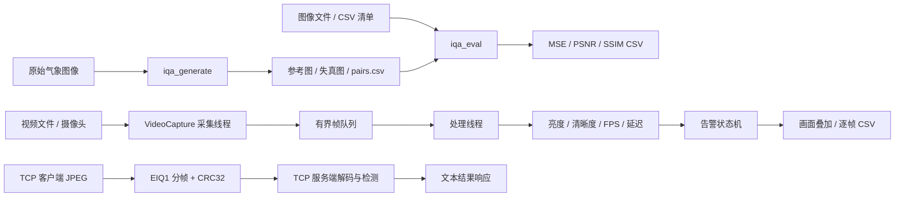

# 系统架构

## 目标与边界

`edge-iqa` 是面向 Linux ARM64 边缘环境的 C++17 图像质量检测与异常告警系统。主线覆盖离线评估、视频流检测、多线程调度和 TCP 图像传输；当前没有把深度学习模型、BRISQUE、真实 V4L2 摄像头和树莓派实机结果计入已完成功能。

## 总体结构

## 模块职责

| 模块 | 作用 |
| --- | --- |
| `metrics` | 计算全参考 MSE、PSNR、灰度 SSIM |
| `image_io` | OpenCV 解码和输入合法性检查 |
| `distortions` | 生成确定性的噪声、模糊和 JPEG 压缩样本 |
| `batch_runner` / `csv_writer` | 读取配对清单，批量评估并输出可追踪结果 |
| `video_source` | 封装 `cv::VideoCapture`，统一视频文件与摄像头输入 |
| `frame_metrics` | 计算灰度均值亮度和拉普拉斯方差清晰度 |
| `alert` | 连续帧触发及恢复滞回，输出四级状态和原因 |
| `bounded_queue` | 用互斥锁和条件变量实现生产者-消费者有界队列 |
| `stream_csv_writer` | 输出逐帧时间、指标、告警和处理延迟 |
| `tcp_transport` | RAII Socket、完整收发循环、固定包头和 CRC32 |

## 多线程设计

采集线程负责 `VideoCapture::read`，处理线程负责指标、告警、叠加与 CSV。二者通过固定容量队列解耦：

- 视频文件：队列满时阻塞生产者，保证离线视频不丢帧；
- 摄像头：队列满时丢弃最旧帧，限制实时链路延迟；
- 结束时：生产者关闭队列并唤醒等待者，避免消费者永久阻塞；
- 统计：记录采集、处理、丢弃帧数和最大队列深度。

该设计保证内存上界，并把文件完整性和实时低延迟两类策略显式区分。当前没有宣称多线程一定提高吞吐量，价值主要是解耦 I/O 与计算并控制背压。

## 告警设计

单帧低于亮度或清晰度阈值时先进入 `WARNING`；连续违规达到 `alert_frames` 后进入 `ALARM`。告警后必须连续正常达到 `recovery_frames` 才恢复 `NORMAL`，避免指标在阈值附近抖动造成频繁切换。未配置阈值时状态为 `UNASSESSED`。

## TCP 协议

TCP 是字节流，不保留应用消息边界。项目定义 16 字节网络序包头：

| 字段 | 大小 | 说明 |
| --- | ---: | --- |
| Magic | 4 B | `EIQ1`，识别协议 |
| Type | 4 B | JPEG 图像或文本结果 |
| Length | 4 B | 负载字节数 |
| CRC32 | 4 B | 负载完整性校验 |

`sendPacket` 和 `receivePacket` 使用循环处理短写、短读和 `EINTR`，服务端限制最大负载并拒绝错误 Magic、CRC 和无法解码的图像。CRC32 只能检测传输损坏，不能提供加密、身份认证或防篡改能力。

## 部署定位

开发机为 Apple Silicon macOS；Ubuntu 24.04 ARM64 Docker 用于 GCC、Linux OpenCV 和 Linux ELF 构建验证。该环境接近树莓派 4B 的 ARM64 用户态，但 Docker 不是树莓派硬件仿真，不能替代摄像头驱动、算力、温度、功耗和长期稳定性测试。
