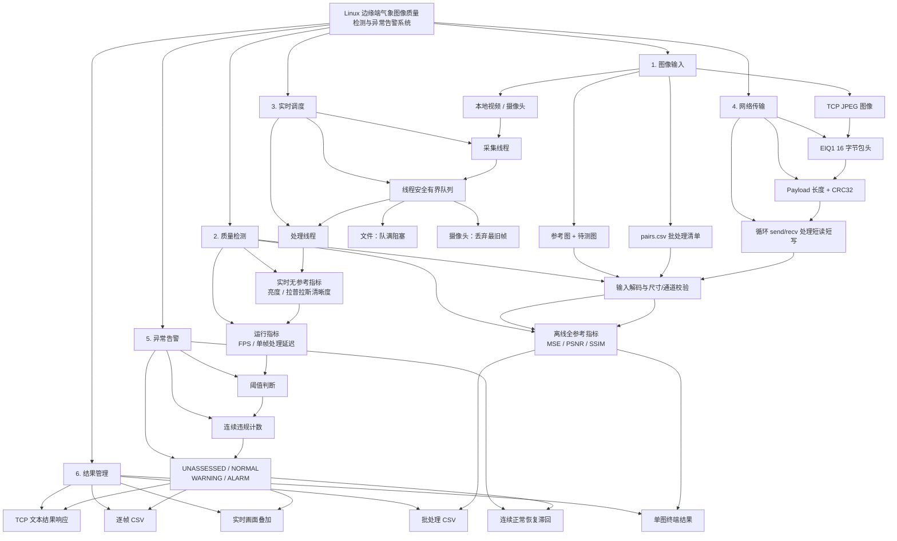
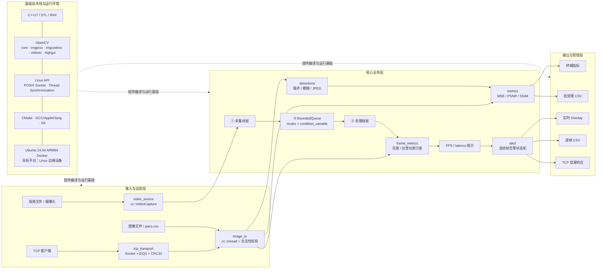

# 系统功能与架构图

## 1. 系统功能层级流转图

这张图从“系统能做什么”出发，展示输入、检测、调度、告警和结果管理之间的功能层级及三条运行路径。

### 三条主流程

1. **离线检测：** 图像对或 `pairs.csv` -> 解码校验 -> MSE/PSNR/SSIM -> 终端或 CSV。
2. **实时检测：** 视频/摄像头 -> 采集线程 -> 有界队列 -> 处理线程 -> 亮度/清晰度/FPS/延迟 -> 告警 -> Overlay/CSV。
3. **网络检测：** 客户端 JPEG -> TCP 自定义协议 -> 服务端解码 -> 实时指标与告警 -> TCP 结果响应。

## 2. 系统模块框图

这张图从“代码如何执行”出发，按输入适配层、核心业务层、输出层和基础技术层划分模块。

## 3. 模块与代码对应关系

| 系统模块 | 主要代码 | 关键技术 |
| --- | --- | --- |
| 离线评价 | `metrics.*`、`iqa_eval` | MSE、PSNR、SSIM、OpenCV Mat |
| 数据集生成 | `distortions.*`、`iqa_generate` | GaussianBlur、RNG、JPEG 编码 |
| 图像输入 | `image_io.*`、`video_source.*` | imread、VideoCapture、输入校验 |
| 实时检测 | `frame_metrics.*`、`iqa_stream` | 灰度均值、Laplacian、FPS、latency |
| 多线程调度 | `bounded_queue.hpp`、`iqa_stream` | std::thread、mutex、condition_variable |
| 告警判断 | `alert.*` | 阈值、连续帧计数、恢复滞回 |
| 网络传输 | `tcp_transport.*`、TCP client/server | POSIX Socket、TCP、CRC32、自定义协议 |
| 结果输出 | `csv_writer.*`、`stream_csv_writer.*` | CSV 转义、批处理与逐帧日志 |
| 工程构建 | `CMakeLists.txt`、`Dockerfile` | CMake、GCC、Ubuntu ARM64 Docker |

## 4. 一帧图像的执行过程

1. `VideoCapture` 从视频文件或摄像头读取一帧 `cv::Mat`。
2. 采集线程把帧及序号、采集时间写入有界队列。
3. 处理线程取出帧，转换为灰度图并计算亮度和拉普拉斯方差。
4. 程序统计单帧处理延迟和滑动 FPS。
5. 告警状态机根据阈值、连续违规帧数和恢复帧数更新状态。
6. 程序将指标和状态叠加到画面，并写入逐帧 CSV。
7. 如果图像来自 TCP，服务端把指标与告警状态封装为结果包返回客户端。

## 5. 图中必须说明的边界

- MSE、PSNR、SSIM 需要参考图，只用于离线全参考检测。
- 实时链路没有严格配准的参考帧，当前使用亮度和清晰度指标。
- CRC32 用于发现数据损坏，不提供加密和身份认证。
- ARM64 Docker 验证 Linux 用户态兼容性，不等于树莓派实机性能测试。
